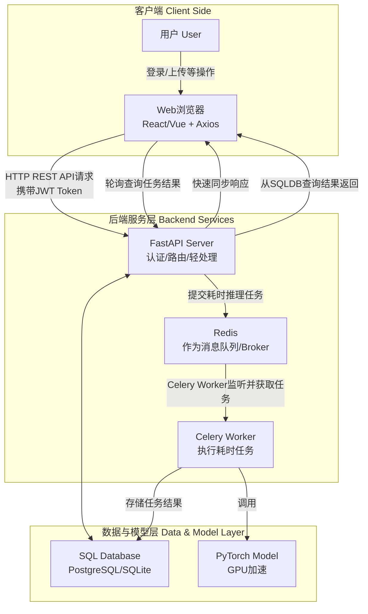

### 为大作业量身定制的技术栈与架构

这个架构设计考虑了你的当前需求（目标检测）和未来可能添加的功能（数据库、用户认证等）。

#### 系统架构图

下图清晰地展示了本方案的核心组件与数据流，特别是引入了数据库和消息队列后各部分的协作关系：

#### 详细技术栈推荐

> 目前的选型是react 18， Axios， vite

- **前端 (Frontend)**:

  - **Vue 3** 或 **React 18**: 二选一。Vue更易上手，React生态更庞大。对于大作业，两者都能完美胜任。
  - **UI 组件库**:

    - Vue: **Element Plus** 或 **Vuetify**
    - React: **Ant Design** 或 **MUI (Material-UI)**

  - **HTTP 客户端**: **Axios**
  - **状态管理 (可选)**: **Pinia (Vue)** 或 **Redux Toolkit (React)**。如果应用不复杂，甚至可以不用。
  - **构建工具**: **Vite**。启动速度极快，开发体验远超 Webpack。

    

> 后端服务框架使用FastAPI，以及由于fastAPI是基于python的，那虚拟环境就用uv了。部署使用Uvicorn。

- **后端 (Backend)**:

  - **Web 框架**: **FastAPI**。性能卓越，自动API文档（Swagger UI）对于前后端联调和答辩演示是**核武器级别**的功能。
  - **数据库 ORM**:

    - **SQLModel** (首选): 由FastAPI作者开发，融合了SQLAlchemy和Pydantic的优点，与FastAPI是天作之合。
    - **SQLAlchemy** + **Alembic** (迁移工具): 更传统和强大。

  - **数据库**:

    - **开发/演示**: **SQLite**。简单，无需安装服务器。
    - **想更专业**: **PostgreSQL**。功能强大，写在简历上更好看。

  - **认证**:

    - **JWT (JSON Web Tokens)**: FastAPI有很好的内置支持，用于无状态的用户认证。

  - **异步任务/消息队列**:

    - **Celery**: Python最著名的分布式任务队列。
    - **消息代理 (Broker)**: **Redis** 或 **RabbitMQ**。对于你这个体量，Redis更简单。

  - **文件上传**: FastAPI直接支持 `UploadFile`，处理图片上传非常简单。
  - **部署 (本地演示)**:

    - **Uvicorn**: 用于运行FastAPI的ASGI服务器。

#### 功能实现路径 (如何一步步完成大作业)

1. **第1步：核心功能 (Must Have)**

   - **后端**: 用FastAPI编写一个最简单的 `/detect` 接口，接收图片，直接调用你的模型进行推理，同步返回结果。
   - **前端**: 创建一个页面，有文件上传按钮，调用这个API，并在图片上绘制检测结果。
   - **目标**: 最基础的目标检测功能跑通。

2. **第2步：数据库与用户认证 (Should Have)**

   - **后端**: 引入SQLModel/SQLAlchemy和SQLite。

     - 创建 `User` 表，实现用户注册/登录端点（密码哈希存储）。
     - 创建 `DetectionTask` 或 `Image` 表，将每次检测任务的结果、用户关联关系存入数据库。

   - **前端**: 添加登录/注册页面，在请求头中携带JWT Token。

3. **第3步：异步任务与高级架构 (Nice to Have) - 这是拉开差距的关键**

   - **后端**:

     - 引入Redis和Celery。
     - 将 `/detect` 接口改造为：接收图片后，立即向Celery提交一个异步任务，并返回一个 `task_id`。
     - 新建一个 `/results/{task_id}` 接口，供前端查询任务状态和结果。

   - **前端**:

     - 上传图片后，轮询调用 `/results/{task_id}` 接口，直到任务完成，再显示结果。
     - 此时可以添加一个“任务历史”页面，从数据库拉取当前用户的所有检测记录。

4. **第4步：优化与展示 (Bonus)**

   - **前端UI/UX**: 利用组件库优化界面，添加加载动画、拖拽上传、结果画廊等。
   - **API文档**: 向老师展示FastAPI自动生成的交互式API文档，非常专业。
   - **部署**: 尝试在局域网内的一台服务器上部署整套系统，而不仅仅是在本地WSL运行。
