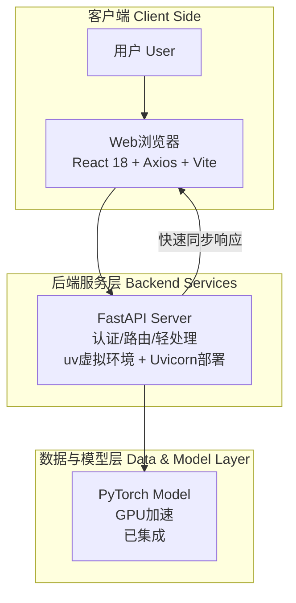

#### 系统架构图

下图展示了完整架构的核心组件与数据流（当前仅实现同步推理路径，异步队列与数据库为规划中）：

#### 详细技术栈推荐

技术选型为（React 18 + Axios + Vite 前端，FastAPI + uv + Uvicorn 后端）。

* **前端 (Frontend)**:
  * **框架**: **React 18**（当前使用，生态丰富，组件复用性强）。
  * **HTTP 客户端**: **Axios**（当前使用，拦截器支持Token管理）。
  * **构建工具**: **Vite**（当前使用，热重载速度极快，开发体验一流）。

* **后端 (Backend)**:
  * **Web 框架**: **FastAPI**（当前核心，自动生成Swagger UI文档，便于调试与演示）。
  * **虚拟环境与部署**: **uv**（Python包管理，速度远超pip/venv）；**Uvicorn**（ASGI服务器，当前本地部署）。
  * **文件上传**: FastAPI `UploadFile`（当前已实现图片处理）。
  * **模型集成**: **PyTorch**（GPU加速目标检测，已运行）。

#### 当前实现

**已完成：第1步 - 核心功能（Must Have）**

* FastAPI `/detect` 接口：接收图片，直接调用PyTorch模型进行同步推理，返回检测结果。
* React前端：文件上传组件 + Axios调用API + Canvas绘制边界框与标签。
* 验证：本地Uvicorn部署，Vite dev server运行，前后端联调顺畅，Swagger UI文档可用。

